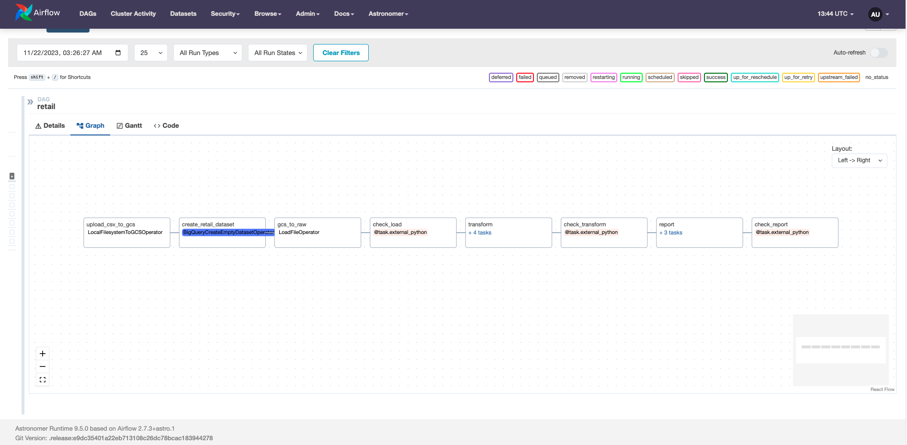
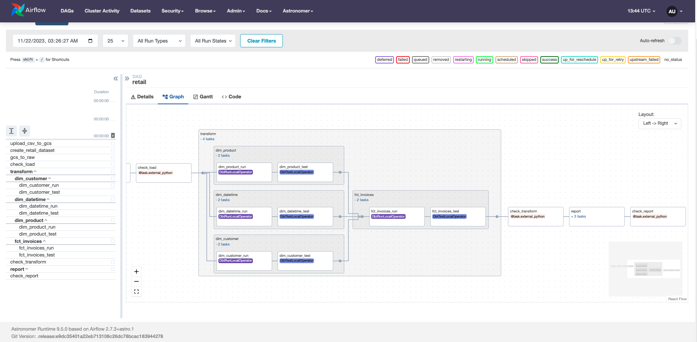
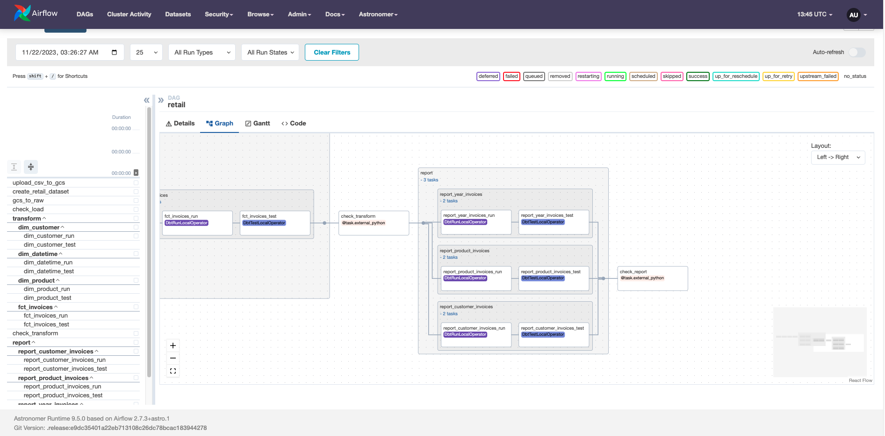
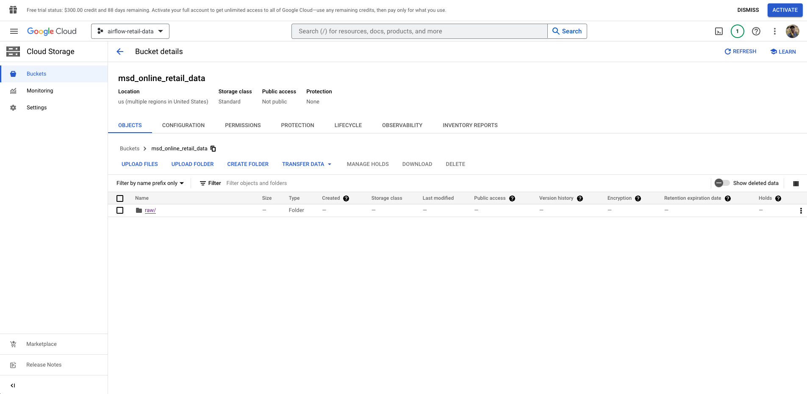
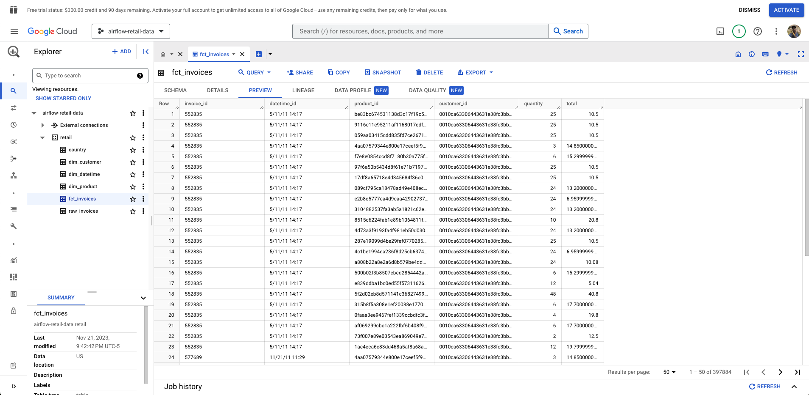
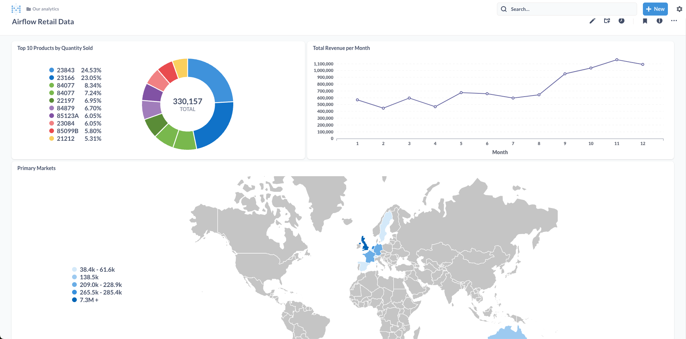

# UK Retail Data Pipeline Project

This project is an end-to-end Apache Airflow data pipeline set up using Astro CLI. 
Data quality checks are completed with Soda while dbt is integrated so models can be run through Airflow and Cosmos interface.
Data is ultimately loaded into GCS BigQuery for visualization using the Astro SDK.

Project composed with aid from tutorial ["An end-to-end Airflow data pipeline with BigQuery, dbt Soda, and more"](https://www.youtube.com/watch?v=DzxtCxi4YaA&t=257s) by Marc Lamberti 

### Airflow DAGS Graph

### GCS Bucket and BigQuery Tables

### Metadata Final Visualization

### Setting up an Astro CLI Airflow Project

1. Start Airflow on your local machine by running 'astro dev start'.

This command will spin up 4 Docker containers on your machine, each for a different Airflow component:

- Postgres: Airflow's Metadata Database
- Webserver: The Airflow component responsible for rendering the Airflow UI
- Scheduler: The Airflow component responsible for monitoring and triggering tasks
- Triggerer: The Airflow component responsible for triggering deferred tasks

2. Verify that all 4 Docker containers were created by running 'docker ps'.

Note: Running 'astro dev start' will start your project with the Airflow Webserver exposed at port 8080 and Postgres exposed at port 5432. If you already have either of those ports allocated, you can either [stop your existing Docker containers or change the port](https://docs.astronomer.io/astro/test-and-troubleshoot-locally#ports-are-not-available).

3. Access the Airflow UI for your local Airflow project. To do so, go to http://localhost:8080/ and log in with 'admin' for both your Username and Password.

You should also be able to access your Postgres Database at 'localhost:5432/postgres'.

